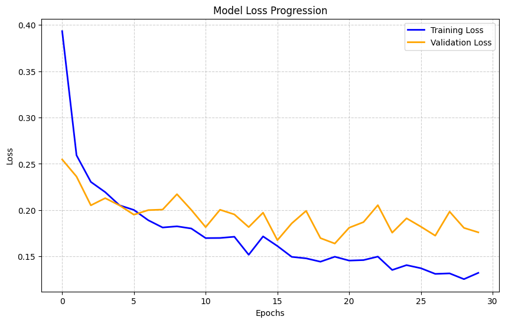
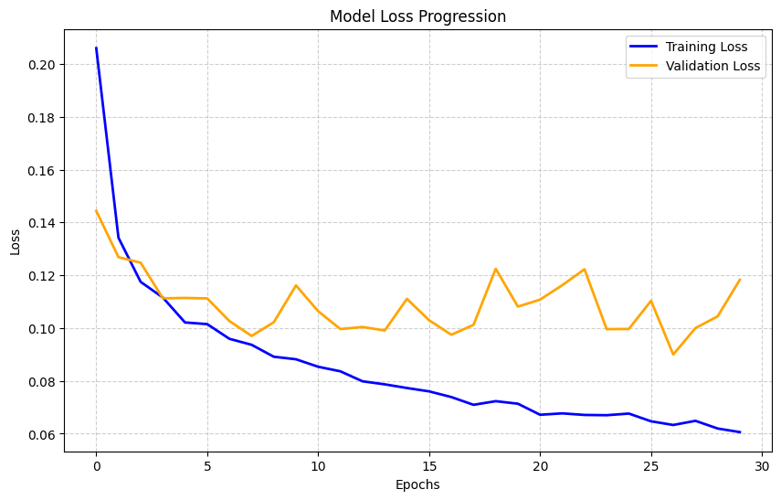
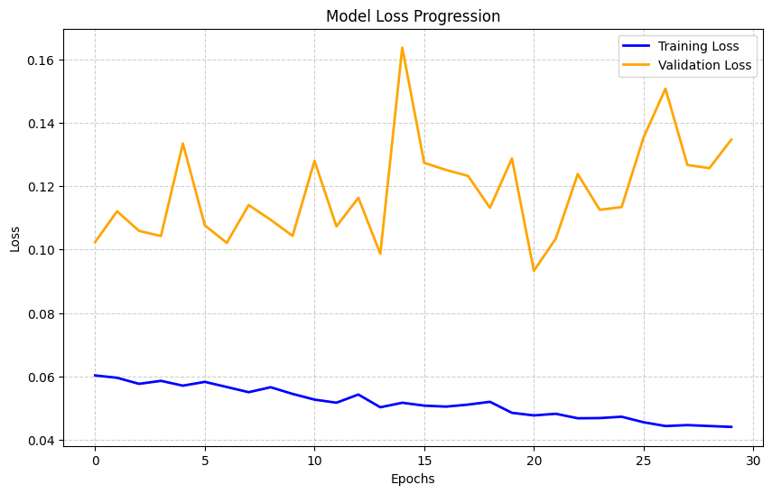
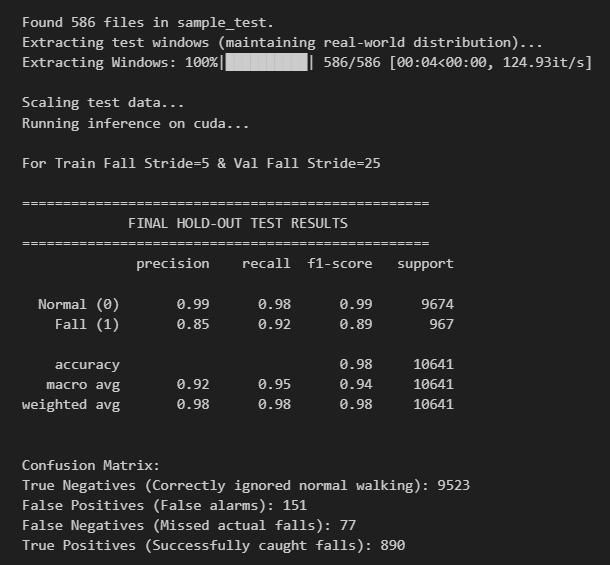

# Log on validation of FALL STRIDE Tecchnique

##  Experiment 1

### Configuration
- **Change:** Fall stride set to **25**

---

### Loss Curve

---

###  Evaluation (Final Blind Test)

---

###  Final Hold-Out Test Results

| Class        | Precision | Recall | F1-Score | Support |
|--------------|----------|--------|----------|---------|
| Normal (0)   | 0.99     | 0.96   | 0.97     | 9674    |
| Fall (1)     | 0.68     | 0.95   | 0.79     | 967     |

---

###  Overall Metrics

- **Accuracy:** 0.95  
- **Macro Avg:** Precision 0.84 | Recall 0.95 | F1 0.88  
- **Weighted Avg:** Precision 0.97 | Recall 0.95 | F1 0.96  

---

###  Confusion Matrix Breakdown

- **True Negatives:** 9240 *(Correctly ignored normal walking)*  
- **False Positives:** 434 *(False alarms)*  
- **False Negatives:** 49 *(Missed actual falls)*  
- **True Positives:** 918 *(Successfully detected falls)*  

---

##  Experiment 2

### Configuration
- **Change:** Fall stride set to **5** for both val and train

---

### Loss Curve

---

###  Evaluation (Final Blind Test)

---

###  Final Hold-Out Test Results

| Class        | Precision | Recall | F1-Score | Support |
|--------------|----------|--------|----------|---------|
| Normal (0)   | 0.99     | 0.97   | 0.98     | 9674    |
| Fall (1)     | 0.77     | 0.95   | 0.85     | 967     |

---

###  Overall Metrics

- **Accuracy:** 0.95  
- **Macro Avg:** Precision 0.88 | Recall 0.96 | F1 0.92  
- **Weighted Avg:** Precision 0.97 | Recall 0.97 | F1 0.97  

---

###  Confusion Matrix Breakdown

- **True Negatives:** 9400 *(Correctly ignored normal walking)*  
- **False Positives:** 274 *(False alarms)*  
- **False Negatives:** 52 *(Missed actual falls)*  
- **True Positives:** 915 *(Successfully detected falls)*  

---
---

##  Experiment 3

### Configuration
- **Change:** Fall stride set to **5** for train only

---

### Loss Curve

---

###  Evaluation (Final Blind Test)
 